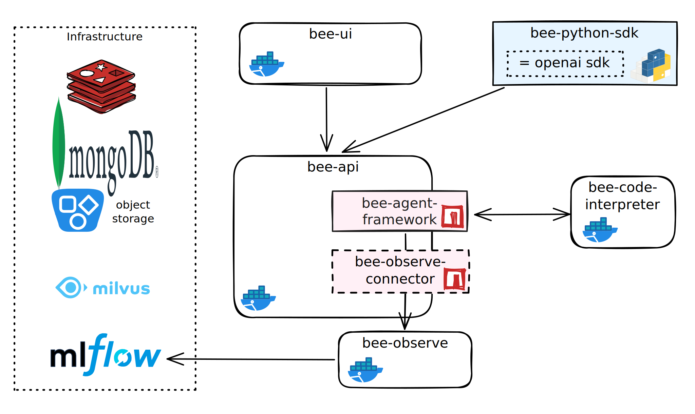

# Bee stack

This repository will help you run the entire bee application stack locally
through **docker compose**. This includes the following bee components along with the
supporting infrastructure:

- [bee-agent-framework](https://github.com/i-am-bee/bee-agent-framework)
- [bee-code-interpreter](https://github.com/i-am-bee/bee-code-interpreter)
- [bee-api](https://github.com/i-am-bee/bee-api)
- [bee-ui](https://github.com/i-am-bee/bee-ui)
- [bee-observe](https://github.com/i-am-bee/bee-observe)
  and [bee-observe-connector](https://github.com/i-am-bee/bee-observe-connector)



## Pre-requisities 🔧

**[Docker](https://www.docker.com/)** or similar container engine including docker
compose ([Rancher desktop](https://docs.rancherdesktop.io/) or [Podman](https://podman.io/))
> ⚠️ Warning: A **rootless machine is not supported** (e.g. if you use podman,
> [set your VM to rootful](https://docs.podman.io/en/stable/markdown/podman-machine-set.1.html#examples))

## Usage 🏃‍♀️

1. Clone this repository

```shell
git clone https://github.com/i-am-bee/bee-stack.git
cd bee-stack
```

2. Configure environment and fill required variables

```shell
cp example.env .env
vim .env # fill in your API key
```

3. Up! (this might take a while the first time you run it)

```shell
docker compose --profile all up -d
```

Once started you can find use the following URLs:

- bee-ui: http://localhost:3000
- mlflow: http://localhost:8080
- bee-api: http://localhost:4000 (for direct use of the api, use apiKey `sk-testkey`)
- list all open ports: `docker compose ps --format "{{.Names}}: {{.Ports}}"`

You can use any typical compose commands to inspect the state of the services:

```shell
docker compose ps
docker compose logs bee-api
```

Stopping services:

```shell
# Stop all
docker compose --profile all down

# Stop all and remove data
docker compose --profile all down --volumes
```

## Advanced 👷

### Development
If you are a developer on `bee-api` or `bee-ui` and want to run only the supporting infrastructure,
use the profile `infra`, e.g.:

```shell
docker compose --profile infra up -d
```
### Connecting to host resources

There are many networking options in both [Podman](https://github.com/containers/podman/blob/main/docs/tutorials/basic_networking.md) and [Docker](https://docs.docker.com/engine/network/)

The bee stack does not explicitly configure a network, so by default typically a bridge network is generated automatically. Additionally a specific host name is made available to the container which represents the host. This can be used to access other services on that host, such as ollama running locally.

The hostnames are:
* host.containers.internal (podman)
* host.docker.internal (docker)

Below is an example `.env` configuration for a podman environment which will allow the bee stack to connect back to ollama running on the host
```
LLM_BACKEND=ollama
EMBEDDING_BACKEND=ollama
WATSONX_PROJECT_ID=
WATSONX_API_KEY=
WATSONX_REGION=us-south
OLLAMA_URL=http://host.containers.internal:11434
```

# Contributing

This is an open-source project and we ❤️ contributions.

If you'd like to contribute to Bee, please take a look at our [contribution guidelines](./CONTRIBUTING.md).
